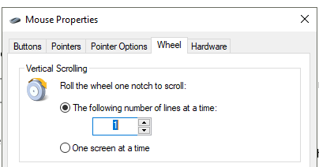

# Drag to scroll  🖱️↕ (Autohotkey, Windows)
This Autohotkey app provides system-wide drag-to-scroll feature. It uses mouse movement for scrolling, which turns out to be more efficient and it reduces stress on the operator's hand, compared to the scroll wheel. So if you want better scrolling experience, or maybe your scroll wheel have broken, then this app is for you.  
Further, if you use a drawing tablet or a touchpad and the driver/OS does not provide drag scroll, then this app solves it.  

> Note: if this version is not working stable, e.g. the context menu still shows up, you can try older version (v03 in the archive folder)  

### Installation
Firstly, you need Autohotkey (v1.1.27+) installed on your PC. The easiest option is to download the .exe installer from the offical site: [www.autohotkey.com](https://www.autohotkey.com)  

Once you have installed Autohotkey, “.ahk” files can be run directly in explorer.  

Download the script:  

[mouse-scroll-v04.ahk](mouse-scroll-v04.ahk)  

### Run the script

Run the “mouse-scroll-v04.ahk”. Now hold the right mouse button and move the mouse to scroll.  
To close the app, manually close the tray icon.  

If you want the app to start automatically at OS startup, copy-paste the shortcut of the “mouse-scroll-v04.ahk” into the Startup folder (%appdata%\Microsoft\Windows\Start Menu\Programs\Startup).  

### Setup 
**Note**: For smoother scrolling, you may first set the system scroll speed to “1” or “2” in system Mouse Properties:   

  
 
To customize the scrolling speed you need to edit the script.
Few setup variables are available, see “User settings” section in the source code. Simply edit the variable in the source code and restart the app (just run again, it should reload automatically).

To set the scroll speed factor, edit the `k` variable:  
> k := 6  

To swap the scrolling direction, set the `swap` variable to “true” or “false”:  
> swap := true  

To use horizontal movement as inputs, set the `horiz` variable to “true” or “false”:  
> horiz := true 				
 

